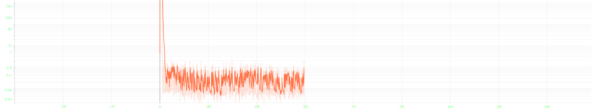

1. 检查代码
   1. 保证import都正常
2. 看作者介绍
   1. resnet blocks 是什么?
   2. 池化之后说是要加几层,为什么(性能上可能好点),什么效果
   3. 破防是什么情况
   4. 为什么要用2个大脑
      1. 看起来像是左右手操作,但是这样不利于协同操作
      2. 后期看下能不能像Dueling那样, 把两个网络整合起来
   5. 通过内存查找角色和BOSS状态?有木有更好的方法?
      1. 使用OpenCV和mod
   6. 多线程的运用
3. 运行HollowKnight
   1. lite HollowKnight 是什么
      1. switch版本的, 没什么用
   2. 存档位置
      1. /Users/huyongsheng/Library/Application\ Support/unity.Team\ Cherry.Hollow\ Knigh
      2. 带bak的是游戏里的自动存档，每次坐椅子或者触发其他存档事件（比如某些boss战，或者送花，等等）就会自动保存一个带编号的bak文件，游戏退出的时候会把最新的bak文件结合当前状态存入user*.dat（这是你每次进游戏读取的东西）。
      3. 进入寻神者,直接挑战BOSS
   3. 如何修改存档,让所有玩法都解锁
      1. 找到解锁了所有玩法的存档, 项目里就有, 找了半天.., √
      2. mod修改:https://www.wolai.com/2oCyqkQtMrrLNgqYsZaTdE, √
      3. mods的保存位置: /Users/huyongsheng/Library/Application\ Support/Steam/steamapps/common/Hollow\ Knight/hollow_knight.app/Contents/Resources/Data/Managed/Mods, √
      4. mod安装失败的log: /Users/huyongsheng/Library/Application Support/unity.Team Cherry.Hollow Knight/ModLog.txt, √
      5. 尝试一个mod: 伤害值显示, DamagedValue, 2个地方都需要文件才能正常运行, √
      6. 显示HP, MP等信息, √
         1. 显示更多信息, 比如角色状态, 精灵边界, √
         2. 如何把相应的信息读取到input中, √
         3. 如何做出自己的mod, 直接能够把相关信息输出, √
         4. 查看debug的mod, √
      7. 创建mod: https://space.bilibili.com/290906064/article
         1. 安装开发环境: 
         2. 按照教程, 制作一个空的mod
         3. 加载Debug的Mod
         4. 查看DebugMod是怎么拿到那些数据的
         5. 尝试输出csv文件
         6. DebugMod的源码: https://github.com/seanpr96/HollowKnight.Modding/blob/master/Assembly-CSharp/ModHooks.cs
         7. api文档: https://radiance.host/apidocs/Hooks.html
         8. 看看都能输出哪些特征
            1. 灵魂获取
         9. 回调太多了, 尽快选取需要的特征
            1. 对象边界, 可以查看DebugMod的源码, 把DebugMod的源码弄下来看看
               1. 对象判定: HitboxRender::TryAddHitboxes
            2. 最关键的信息: 自己的位置, 敌人的位置, 子弹的位置, 敌我的状态, 边界
               1. knight-> 黄色
               2. enemy -> 红色, 包括了所有带伤害的东西, 都认为是敌人
               3. attack -> 青色
               4. terrain -> 绿色, 地形
               5. trigger -> 蓝色
               6. breakable -> 粉色, 可以打坏的
               7. gate -> 深蓝
               8. other -> 橙色
            3. 使用的是Collider2D类型, 用于碰撞检测, 包括以下几种子类
               1. BoxCollider2D, 圆角矩形, 忽略了圆角, 用点集
               2. PolygonCollider2D, 多边形, 点集
               3. EdgeCollider2D, 椭圆形, 点集
               4. CircleCollider2D, 圆形, 单独绘制的
            4. 如何把状态作为入参
               1. BoxCollider2D, 用2个点的坐标, √
               2. PolygonCollider2D, 用矩形包裹, 也是2个点的坐标, √
               3. EdgeCollider2D, 用矩形包裹,也是2个点的坐标, √
               4. CircleCollider2D, 用矩形包裹, 还是2个点的坐标, √
               5. enemy, 需要确定名称, 使用OneHot, 这里会把维度提升得很高, 前期维度应该比较低
               6. knight就一个, √
               7. attack可能有多个, 最大也就3个吧(黑吼, 深渊尖叫, 黑砸, 黑暗降临), 武器用的也是attack, √
               8. enemy最大限制20个(前期应该是够了), 如果不够, 就随机在预留的地方挑选
               9. 边界(有可能会存在掉落的情况), 用最多10个矩形吧, √
               10. knight的状态, 感觉bool型数据可以作为oneHot输入
                   1. 状态: 空闲, 空降, 跑步
                   2. 速度: 水平, 垂直
                   3. HP: 9
                   4. MP: 198
                   5. isInvuln: 是否受伤
                   6. accept input: 是否接受输入, 黑砸的情况下无法接受输入
                   7. dash: 是否冲刺
                   8. jumping: 是否跳跃
                   9. superDash: 是否黑冲
                   10. failing: 是否下落
                   11. recoiling: 是否后坐力
                   12. wall lock: 不清楚和墙有啥关系
                   13. wall jumping: 不清楚和墙有啥关系
                   14. wall touching: 是否到了墙边
                   15. wall sliding: 是否在墙上下滑
                   16. attacking: 是否正在攻击, 攻击状态下貌似不能按攻击键
                   17. canCast: 不清楚
                   18. canSuperDash: 是否可以黑冲
                   19. 就这些了,其他的也看不懂
            5. 如何编写Mod
               1. 代理ColliderCreateHook, 有新sprite时检测
               2. GUI里面的update每帧都会调用,看下调用时机
                  1. 如何保证自己的代码每帧都能运行到
               3. HitBox设置为一个单例, 场景改变时, 清空保存的Collider2D
                  1. 不能这么干, 会导致元素丢失的, 只能是删除对象, 再重建, 这是DebugMod的方案
                  2. 如何设置单例
                  3. 添加Collider2D
                  4. 删除Collider2D
                  5. 输出边界到log, 先输出knight的, 然后在考虑其他的情况
                     1. 输出的坐标不对, 可能是镜头camera的缘故, 看下DebugMod的源码, 矫正下位置
                  6. 输出BOSS的位置, 附带它的技能伤害位置
   4. 找到挑战的boss, 并且击败^_^
4. 设计思路
   1. 最小化验证模型
      1. 只要能分清楚敌我位置, 就把数据塞入DQN网络, 进行学习
         1. 输出knight的位置, √
         2. 输出boss的位置(可能有多个)
            1. 大黄蜂的位置, √
            2. 武器的位置(是个多边形), 需要使用map转为世界坐标才能知道具体该怎么用
               1. 多边形每次都是5个, 是不是有些已经不在画面内了啊, 输出knight的坐标参考下
               2. 先输出多边形, 再输出矩形, 看下效果对不对
            3. 技能的位置(是个圆形)
         3. 不要放到log里, 而是通过跨进程的方式, 考虑socket等方式
            1. pipe, 管道, 半双工, 单向流动, 父子进程, ×
            2. NamedPipe, 命名管道, 半双工, ×
            3. 信号量, 锁机制, 同步手段, ×
            4. 消息队列, 需要操作系统提供队列, 跨平台性能不够, ×
            5. 共享内存, 需要额外的控制, ×
            6. socket, 套接字, 考虑下, DomainSocket, 域套接字, 通过文件的方式进行, √
               1. 了解python的多进程
                  1. 实现多进程之间的通信, √
                  2. 建立一个服务端, 等待其他进程传送数据, √
               2. 额外学习了π的计算方法, 算是意外惊喜, √
               3. C# 创建一个客户端, 每一帧的log输出改成使用socket输出, √
                  1. 可以先使用简单的数据结构, 等能够跑通了, 再上定义的协议, √
                  2. UnixDomainSocketEndPoint在空洞骑士上无法使用, 看看有木有替代方法, 不行就只能用ip了, ×
                  3. UnixDomainSocketEndPoint是新版本的内容, DebugMod用的是老版本, 所以只能用ip和端口了, √
                  4. 能够连续输出数据, 目前卡在这了, 直接接收到一次数据, ×
                     1. 面向连接, 面向非连接, √
                     2. 有阻止, 无阻止, √
         4. 通过Python读取socket, 恢复数据
            1. 读取数据, √
            2. 恢复数据, √
         5. 通过Python向HollowNight输入动作(左, 右, jump)
            1. python怎么模拟键盘: https://www.ailibili.com/?p=560
            2. Mac会拦截, 需要授予权限, √
            3. pyautogui还有额外的功能: 屏幕快照, 可以考虑作为录制视频的工具, √
            4. pyautogui怎么支持第二块屏幕, √
               1. 使用工具后发现是x为负坐标, √
            5. pyautogui在mac环境下不能获取window, 那就需要固定HollowKnight的串口位置, ×
               1. HollowKnight只需要键盘操作就行了, √
            6. 尝试在游戏中完成移动, 跳跃的功能, √
         6. 能够完整的联调起来
            1. 当进入到大黄蜂场景时, 开始接受数据, 给出操作, √
            2. 当离开大黄蜂场景时, 执行脚本, 再次开始操作
            3. 如何跳出循环?
               1. 每局结束之后, 空出一段时间来结束python任务
         7. 使用DQN来训练
            1. 先来一个简单的DQN, √
               1. 尝试使用lambda构建隐藏层, ×
            2. 在游戏输出和AI输入之间存在一个较大的时间延迟, 可能是print函数带来的, 关闭试试, ×
               1. 关闭print没有太大改善, ×
                  1. 无太大改善, 可以进行print, √
               2. 看下输入和返回的时间间隔多大(aps:action pre second), √
                  1. aps=1时, 0.5ms, √
                  2. dps=10, √
                     1. 发生了数据粘黏现象, ×
               3. 寻找其他解决方案, √
                  1. 使用send-receive机制防止粘包, √
                     1. 完成一次动作需要500ms, 时间有点长, × 
                     2. 貌似时sleep和计算时间的函数有问题, 经过调整, 平均耗时为0.5ms, 完全可以胜任, √
            3. 拆分输入
               1. 是否需要json来传递?, √
                  1. 方便添加数据, √
                  2. 但是效率比较慢, ×
                  3. json无法打包, ×
                     1. HollowKnight 使用的是Newtonsoft.Json, 那就尝试使用这个json工具吧, √
               2. python序列化json, √
               3. 拆分成不同的动作执行, √
               4. 运用模拟程序运行, √
               5. 使用游戏运行, √
         8. 使用DQN来完成躲避boss, 并且尝试进攻
            1. 把knight的坐标和enemies的坐标给dqn, √
               1. 需要先分解数据, 修整数据, √
               2. 
            2. 从dqn获取action, √
               1. shape报错了, 与规定的shape不一致, ×
                  1. 通过mod输出json,查看到底是为什么shape不对, √
                     1. 估计是还没有敌人, 只有knight, √
                        1. 强制设置shape, 让一个对象循环使用, 不要new新对象, √
            3. 设置reward
               1. knight的生命丢失, √
               2. boss的生命丢失, √
            4. 设置经验池
               1. 优先做, learn需要利用到经验池, √
                  1. 具体多大
                     1. 每秒60帧, 一局大约30秒, 2倍设置吧, √
                  2. 需要保存哪些数据
                     1. index, 索引, √
                     2. state, 当前游戏的状态, √
                     3. action, 选取的动作, √
                     4. reward, 得到的奖励, √
                        1. 需要C#把当前的生命值传入
                        2. 先简单些, 给一个假设的奖励, 后期再补, √
                        3. 奖励是上一步的奖励, 需要注意, √
                  3. 完成recall方法, √
            5. 完成learn函数, 让dqn开始学习
               1. 每次退出BOSS房间, 开始学习, √
               2. 尝试再次进入BOSS房间, 继续训练, √
               3. 完成一段时间的学习后使用脚本,再次进入BOSS房间, √
                  1. 启用一个新线程或者进程, 延迟一段时间后模拟按键, √
                  2. 提供一个退出的方案, 稍微挪动下, 不要出挑战面板就可以了, k代表跳跃, 小跳一下说明循环结束了, √
            6. 保存模型
               1. 经验池, √
               2. 当前的模型参数, √
            7. 读取模型
               1. 经验池, √
               2. 当前的模型参数, √
            8. 想办法检测学习效果
            9. 其他问题
5. 做一个简单的env, 验证模型是对的
   1. 把每一帧绘制出来, √
      1. 一段时间后knight消失了, √
         1. right<left导致的, √
      2. loss变低, 之后突然增大, √
         1. value值非常大, √
            1. states和next_states很大, √
               1. 这个是对的, 记录的是knight和enemies的坐标, √
               2. 有必要把坐标改成相对值, ×, 作用不大, loss提升还是很快, ×
                  1. 不清楚具体是如何计算的, 那就直接用屏幕大小相除吧, 简单轻松, √
            2. 每一步都仔细检查下, √
               1. 模型进入到了一个正向循环里面, 会越滚越大的, √
                  1. 使用softmax, √
      3. 把绘制函数放到client里面, 可以方便观察效果, √
   2. boss位置固定, 验证knight可以走到boss身边, √
      1. random时左右摇摆, 不会进行探索, √
         1. random时, left, right固定循环, √
      2. prediction时只往右移动, √
         1. prediction时检查下概率, √
            1. left为0, right位1, √
         2. 把墙边作为禁区, 靠近的话就给负反馈, √
            1. 通过判断是否触碰到墙, 可以得到墙的坐标, √
            2. 也可以在random阶段, 用最大最小值得到墙的坐标, ×
            3. left和right的值都小的可怕, 全是idle, √
               1. 奖励设置不合理, 如果负奖励很多, 就会导致全是idle, √
   3. boss开始移动, 验证knight可以走到boss身边, √
      1. 验证通过, √
   4. boss开始移动, 验证knight可以通过跳跃完成对boss的躲避
      1. knight不用移动, √
         1. 并未感觉到knight有明显的躲避boss的意图, √
            1. action_reward没有得到任何奖励, √
               1. 距离计算错误, 全是负奖励, √
                  1. 调整reward计算方式, √
         2. knight不停跳跃, 完成验证, √
      2. knight移动, √
         1. 有明显的躲避和跟随行为
         2. 但是还是存在碰撞的情况
   5. boss添加技能:冲刺, 验证knight可以跳跃完成对boss的躲避
   6. boss添加技能:attack, 验证knight可以跳跃完成对boss的躲避
   7. knight添加攻击, 验证knight可以完成对boss的击杀
   8. knight添加上劈和下劈, 验证knight可以完成对boss的击杀
6. 开始真正的AI
   1. 验证模型可学习, √
      1. 选择攻击键, 只要执行了攻击就给reward, 一段时间后只出现攻击, 这就验证了模型可学习
         1. 执行了过多的None操作和左移操作
            1. 增大经验池, √
            2. 如果数据不够, 就采取随机动作, √
         2. 学习只发生在战斗之后, 学习效率太慢了
            1. 循环多次进行学习, 充分利用下一句的等待时间, √
            2. 采用线程的方式, 避免学习太慢, 无法处理下一场数据, √
            3. 离开游戏后, 保存当前数据, 输出保存的pool大小, √
            4. 输出里有个warning, shape不对, 需要调整下, √
               1. batch_size不要固定就行了, √
         3. 让模型跑到36000条数据吧
            1. 跑了一晚上,还是没有达到只攻击的预期, 需要使用更小的demo验证模型正确
               1. 造一个Python客户端发送固定数据, 验证模型的梯度下降能力
               2. 使用tensorboard监控loss变化, √
                  1. 运行turing时启动tensorboard, ×
                  2. 学习在一个独立的线程, 需要把writer放在独立的线程里才生效, √
               3. 单步分析, 程序哪里不正确
                  1. 预测的32个actions中, 每个action的前4项为0, 最后一项为1
                     1. 是不是模型有问题
                        1. 把模型简化到比较少的params, √
                        2. 隐藏层默认使用的是linear, 是否要改成relu, √
                        3. softmax一般是用来生成概率的, 不用加这一层试试, √
                           1. **去掉softmax之后, 显示出每个动作的value**, √
                              1. **因为输入的坐标比较大, 导致输出的value也相对较大, softmax有效值在(0,1)之间**, √
                           2. 测试数据是立竿见影, 拿到游戏中试试
                        4. huber作为损失函数, 效果未知, 可以考虑优化
                  2. 经过一番调整,所有预测都为nan了,查看哪里出现了问题, √
                     1. 参考: https://www.zhihu.com/question/49346370/answer/2282004200, √
                     2. 先输出一下每一步的预测值, 看下是不是越来越大了, √
                        1. 读取模型的第一步已经是nan了,看来要换下模型了, √
                           1. loss变化: [35, 23635, 240802, 1528594], √
                              1. q和target_q变得越来越大, √
                                 1. action_values越来越大, √
                                    1. 每一步都有给奖励, √
                                       1. 可以设置负奖励(惩罚)进行平衡, ×
                     3. 可能是梯度爆炸, √
                        1. 减少学习率, √
                           1. adam的默认学习率就是0.001, 就用这个吧, √
                        2. 归一化
                           1. 坐标点可以放到(-1, 1)区间内, width:1920, height:1080, √
                              1. 让插件直接输出小数就行了, 不需要转成真实坐标, ×
                                 1. 无法明白transform的具体算法, 还是到Python里面转吧, √
                           2. 检查下是不是坐标有问题, ×
                              1. 可以画出示意图, 没有问题, √
                        3. 加入gradient clipping, ×
                           1. 梯度不大, 没必要裁剪
                        4. 回过头来学习下梯度消失和梯度爆炸
                           1. 链式求导->梯度累乘->指数变化
                              1. 减少层数, 同时增大每层数量, √
                     4. loss出现分母为0的情况, ×
                     5. 脏数据, 出现log(0)的情况, ×
            2. 使用独立的线程, 不断地学习, √
               1. 学习速度太快了, 需要减缓下速度, √
                  1. 把深度和广度提高, 输出频率降低, √
      2. 使用模型跑的动作基本都是攻击, 并且loss迅速收敛到1以下, 验证了模型可学习, √
   2. 验证模型可以完成击杀
      1. 做一个简单的客户端, √
      2. 正常的奖励, √
      3. 随时间变化的探索率
      4. 记录每局结束后BOSS的血量, √
      5. loss降低到一定程度就不要再随机动作了
         1. 差不多第8次战斗就开始AI介入了, √
         2. 最开始null的价值还是挺低的, √
         3. null价值提升的速度很快, 到第9次战斗, null的比例已经接近80%了, √
            1. 观察下输入的具体坐标都对不对, √
               1. 武器和boss位置正确, 其他的坐标不太理解, √
                  1. 输出下具体的内容(多边形, 名字, 是否激活等信息), √
                  2. boss的位置有些不对, √
                     1. 坐标转换, √
                     2. 去掉小数点, √
                  3. isActive好像也不对, √
                     1. 看下源码, 是怎么判定的, √
                  4. 数据过多
                     1. Clash Tink, 可以去掉, 与slash基本相同, √
                     2. 用不到的数据就不要输出了
                        1. 拿到攻击范围后就不用再去拿了, √
                        2. enemies如果未激活也不需要, √
                        3. 进一步减少key的长度
                     3. 减少输出的频次
                        1. 目前是60帧, √
                        2. 一次attacking是(8, 15)帧, √
                        3. 降为20帧, 15帧, 12帧, 甚至是10帧, √
            2. 如何设置虚拟奖励
               1. 寻找攻击范围, √
                  1. x轴攻击距离(=306, 参考): AltSlash, Slash, √
                  2. y轴攻击距离(=270, 306, 参考): DownSlash, UpSlash, √
               2. 当前的knight状态也需要输出, 可能无法攻击, 无法跳跃, 无法冲刺等
                  1. 把knight的状态输入到Python, √
                     1. 查看下debug-mod是怎么获取到knight的状态的, √
                        1. InfoPanel.GetHeroPos, √
                        2. CustomInfoPanel.GetMainInfoPanel, √
               3. 与BOSS的范围作为一个连续奖励标准
                  1. 按照x轴攻击距离设置一个函数, 先让模型跑起来, √
                  2. null的数量计算不对, √
                     1. knight.actions里面存放了str类型, 可能是早期为了方便吧, √
                        1. 是因为json无法序列化float64, 全部转为float吧, √
                     2. mock一个简单的客户端, 看下哪里不对, √
                  3. 早期null比较低, a, d, j, k差别不大, 后期这5个都没什么差别了
         4. 每一个动作的价值都比较接近了
            1. 调整真实的动作输入, √
         5. knight基本无法移动, √
            1. 移动键需要长按, √
               1. 看下是否需要把idle设置为取消长按效果
         6. 动作价值基本都在(-1,1)之间, 没有体现出价值来
         7. 到了17回合, 全都是null输出了, √
            1. 估计是reward设置的有问题, 想想问题出在什么地方
               1. 动作太频繁, √
                  1. 优化动作的输出, √
               2. 奖励太稀疏了
                  1. 先研究下论文, 看看巨人都是怎么处理稀疏奖励的
                     1. 这居然就是强化学习的核心问题
                  2. 解决方案
                     1. 奖励设计与学习
                        1. 人为设置多段奖励
                           1. 不通用
                           2. 错误引导， 局部最优
                           3. 安全隐患
                        2. 最优交互序列（逆强化学习）（模仿学习）
                           1. 通过专家决策数据在马尔科夫决策过程中逆向求解环境奖励函数
                              1. 寻找一个或多个奖励函数描述专家决策行为
                                 1. 基于最大间隔
                                 2. 基于确定基函数组合
                                 3. 基于参数化表示， 适用于深度神经网络
                     2. 经验回放机制， 适用于离策略的学习算法
                        1. 优先经验回放法， PER， （评价挺高的， 优先尝试）
                           1. 优先采用有较大TD-Error的样本 
                     3. 探索与利用
                        1. 传统主要方法：e-贪心， 概率匹配， UCB， Thompson采样， 贝叶斯探索
                        2. DRL任务： 计数方法， 内在激励， 目的是构造虚拟奖励，用于和真实奖励函数共同学习
                           1. 基于计数：使用状态的访问频率来衡量状态的不确定性， 越少说明越新颖
                              1. 虚拟计数：使用状态空间上的概率生成模型来衡量状态出现的频率
                                 1. 信息增益：之前的状态-之后的状态
                           2. 基于内在激励：变分信息最大化， 基于好奇心探索
                     4. 多目标学习
                        1. 虚拟目标替代原始目标
                     5. 辅助任务
                        1. 课程式：从简单的任务开始， 不断增加难度
                        2. 添加并行的辅助任务
                           1. 可以从辅助任务中获取奖励
            2. 可以参考下其他人是怎么设计奖励的(人为设置多段奖励)
               1. 分成move_reward和act_reward
                  1. move: 如果boss在放技能, 单独给奖励
                  2. move: 根据当前的移动状态和boss间的距离计算奖励
                  3. act: 分成skill_reward, distance_reward, self_blood_reward, boss_blood_reward
                     1. skill_reward, 自己算吧
                     2. distance_reward, 没看明白
                     3. hp, 都一样
               2. 关键是每一步都给出了具体的奖励值
               3. 而且还是分成2个网络, 分别给不同的奖励值
               4. 每0.1秒才给出一个动作和一个奖励
         8. 根据重新设计的规则, Turing选择attack和down_attack的频率很高, 但是负值比较多, 而且也无法体现出动作很大的差异
            1. BOSS血量下探到了600, 可喜可贺啊
            2. 增大正向奖励, 减少负向奖励
            3. 把左右移动单独拿出来, 做成独立控制
               1. 借鉴Dueling-DQN的方法, 把网络拆分成2个输出, √
            4. 增大掉血的负向奖励, 要不Turing只为了攻击BOSS, 完全不管自己状况
      6. 保存每一个动作的价值,便于后期查找原因, √
         1. tensorboard是否支持, √
            1. text支持, 需要自己去计算每一句的分布, √
               1. 战斗结束后进行统计, √
            2. text还支持json, √
            3. 将tensorboard的log按照时间分文件夹, 方便查找, √
         2. 优化下模拟程序
            1. 对一局中boss的状态进行保存, 人为分析
      7. jump不能带来收益
         1. y轴reward设计
         2. 增加high_jump, low_jump, double_jump做具体区分
         3. reward计算学习的时候需要分离, 让其分别计算下降梯度
            1. 先关掉action的奖励, knight调为无敌, 验证只有move作为reward时, knight是否正确移动
            2. 是否随机, 也需要独立计算
            3. 分离后, action的奖励又变得稀疏了
               1. 把jump的奖励也作为action的reward
      8. turing已经学会了使用attack来获取奖励, 需要配合jump和move来获取更多的奖励
   3. 优化模型
      1. knight状态输入
      2. 技能输出[具体数值](https://spica.cloud/2019/07/12/Hollow-Knight%E6%B8%B8%E6%88%8F%E6%80%BB%E7%BB%93/)
         1. 攻击(下劈, 上劈), 21 * 1.5 = 32
            1. WallSlash
            2. AltSlash
            3. Slash
            4. UpSlash
            5. DownSlash
         2. 冲刺, 0, **无敌**
         3. 旋风斩(蓄力), 1.25倍, 3~7次, 79~184, Hit L, Hit R
         4. 强力斩(蓄力), 2.5倍, 52, Great Slash
         5. 冲刺斩(蓄力), 2.5倍, 52, Dash Slash
         6. 暗影之魂, 30, Fireball2 Spiral(Clone)
         7. 黑暗降临, 15(俯冲) + 30(低波) + 15(高波) = 60, **无敌**
            1. Q Fall Damage
            2. Hit L
            3. Hit R
         8. 深渊尖叫, 20 * 4 = 80, 滞空
            1. Hit R
            2. Hit L
            3. Hit U
      3. boss输出
         1. Hornet Boss 2
         2. Hit GDash
         3. Hit ADash
         4. Sphere Ball
         5. Hit Counter 1
         6. Hit Counter 2
      4. 优化奖励
         1. 考虑MP
      5. BOSS状态
         1. 需要BOSS周围图像, 做图像分类
      6. enemy分类
         1. 尝试从脚本中获取
      7. 其他BOSS
      8. 竞技场
      9. 最小化cell数量
         1. 超参设置, 可以使用tensorboard观察
      10. 最小化学习时间
      11. 输出视频
      12. dqn的其他结构